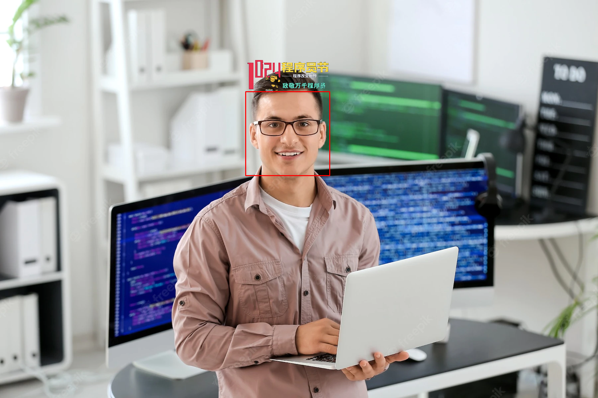
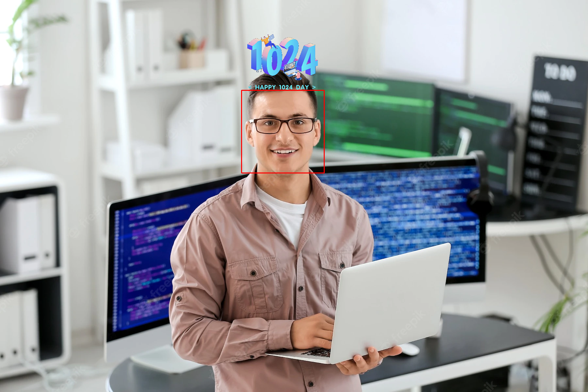

## OpenCV 的一些有趣应用

一些采用 `opencv3` 图像处理库做的一些玩具项目，有检测人脸应用和基本的图像处理操作等。

## 环境说明

- `Windows10`、`Ubuntu16.0+`、`Mac OS`
- `Python3.5+`
- `OpenCV3.1+`
- `VSCode、PyCharm`

`Steps`: 例如在 `windows` 的 `cmd` 窗口下跳转到程序仓库目录运行 `python face_detect.0.py`，或者用 `VSCode` 代码编辑打开源代码按 `f5` 运行即可。

### 人脸应用

代码及算法思路博客文章讲解在[这里](从零开始实现人脸检测+抖音特效+1024特效功能)。

1，[人脸检测](face_detect_demo/face_detect.py)。程序运行后输出效果图:

2，[人脸抖音晃眼睛特效](face_detect_demo/douyin_effect.py)

3，[头顶加LOGO标志](face_detect_demo/add_logo.py)

4，[头顶加帽子](face_detect_demo/add_hat.py)

5，[人脸检测+抖音特效+1024特效功能](face_detect_demo/opencv_face_demo.py)

## Reference
1. [LearnOpenCV](https://learnopencv.com/read-display-and-write-an-image-using-opencv/)
1. https://github.com/CharlesPikachu/pydrawing
2. https://google.github.io/mediapipe/solutions/face_detection.html